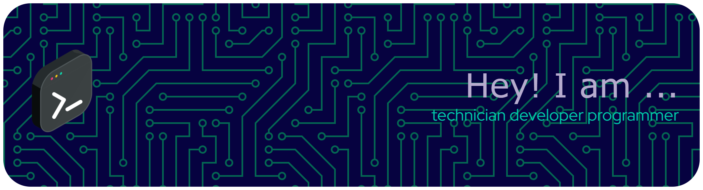

# 👋 Hola — Soy Serio120

<!-- Badges -->
 
 
 
 
 

<!-- Profile stats -->

Desarrollador de software centrado en Backend (Java/Spring), Python para automatización y web scraping, con experiencia en Big Data (Scala/Spark) y Frontend (React/Angular). Creo contenido educativo: roadmaps, laboratorios y guías prácticas para que otros aprendan y construyan software moderno.

---

## 🔭 En qué trabajo

- Desarrollo APIs y aplicaciones backend con Java y Spring Boot.
- Automatizo tareas y creo scrapers en Python para extracción y procesamiento de datos.
- Diseño pipelines de datos y pruebas con Scala/Spark.
- Construyo interfaces y proyectos prácticos con React y Angular.
- Elaboro roadmaps, laboratorios y recursos para aprender tecnologías modernas (Azure, .NET, DevOps).

## ⭐ Proyectos destacados

- [roadmap-backend-developer](https://github.com/Serio120/roadmap-backend-developer) — Guía paso a paso para convertirte en Backend Developer.
- [roadmap-python-developer](https://github.com/Serio120/roadmap-python-developer) — Roadmap y recursos para desarrolladores Python.
- [big-data-pipeline-medallion](https://github.com/Serio120/big-data-pipeline-medallion) — Ejemplos de pipelines y datos sintéticos con Scala/Spark.
- [react-app-01](https://github.com/Serio120/react-app-01) — Proyecto React práctico.
- [python-job-listings-scraper](https://github.com/Serio120/python-job-listings-scraper) — Scraper para listados de empleo (automatización).
- [unlighthouse](https://github.com/Serio120/unlighthouse) — Herramienta para auditar rendimiento con Lighthouse.

> Tengo más ejercicios, retos y proyectos de práctica en mi perfil — revisa los repositorios públicos.

## 🛠️ Tecnologías

Java • Spring Boot • Python • Flask • Scala • Apache Spark • React • Angular • JavaScript • HTML/CSS • SQL • MongoDB • Docker • Azure • Git

## 📚 Contenido educativo

Me apasiona crear material práctico: desde roadmaps y laboratorios guiados hasta ejercicios de algoritmos. Mi objetivo es ayudar a quienes aprenden a pasar de la teoría a la práctica.

## 🤝 Colaboraciones y contacto

Si quieres colaborar o tienes una propuesta, abre un issue en alguno de mis repositorios o envíame un mensaje por GitHub.

- GitHub: https://github.com/Serio120

---

Gracias por visitar mi perfil — si te interesa algo concreto, abre un issue o escribe y lo hablamos 👋
